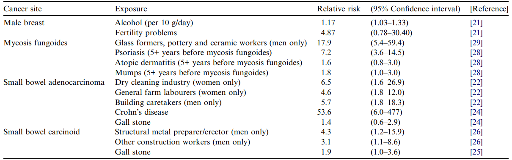
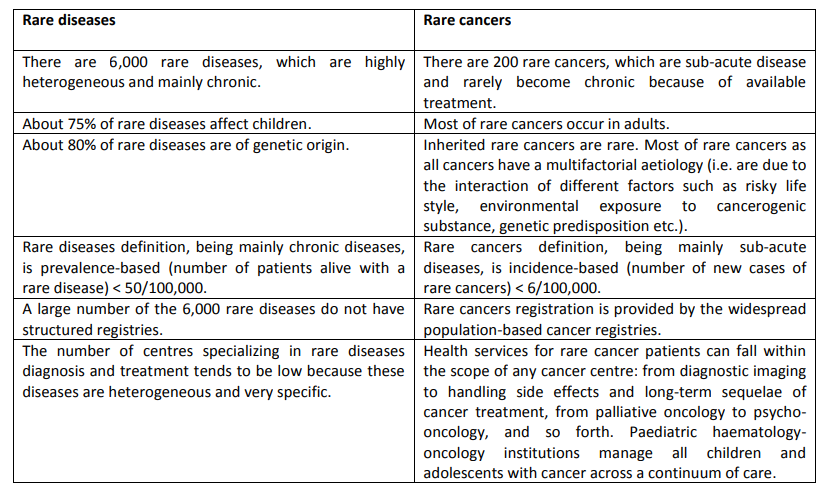
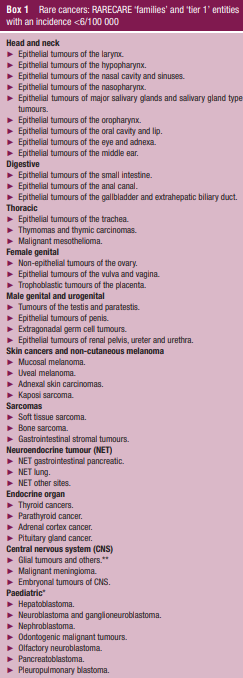
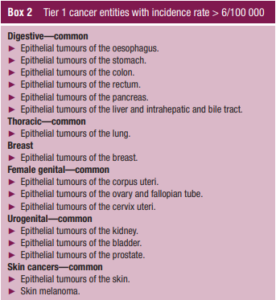

@the_lancet_oncology_very_2001

- For example, lymphomatoid granulomatosis (less than 50 cases a year in the USA) is often misdiagnosed as T-cell lymphoma and is consequently mistreated. It is typical for patients to go for over a year without a proper diagnosis. #диагноза

- The US Congress Orphan Drug Act 1983 defines ‘rare’ as “under 200 000 cases in the USA, or more than 200 000 cases but no reasonable expectation that the costs of developing a new drug for this condition will be recovered from its sales”

- Oncologists obviously have to devote most of their time to managing patients with common cancers and will understandably concentrate on publishing on these diseases. Physicians may only see a very rare
  
- cancer once or twice in their career, yet the importance of discussing and disseminating information on these cases should not be underestimated.

@Tan2003

- For studies to have sufficient statistical power ( ≥ 80%) to detect treatment effects of this magnitude, several hundreds of deaths (typically 200 to 500) need to be observed. This implies trial sizes that are unrealistically large for rare cancers.

@Gatta2006

- These problems can be addressed by use of population-based cancer-registries data to avoid selection bias and by compilation of large international databases on rare cancer
  
- We defined rare cancers as those with an annual crude incidence rate of less than 2 per 100 000 for both sexes combined.
  
- We have shown that survival for rare cancers decreased with increasing age at diagnosis, as for most common cancers.
  
- With regard to variations in survival across geographic groups, differences in access to diagnostic facilities and specialised treatments may be important, since these vary markedly across Europe. However, in much of northern and western Europe, multidisciplinary specialist care is well developed. In some countries of eastern Europe, cancer services are commonly provided by oncologists and surgeons who are not specialised in the treatment of particular cancer sites; moreover, few of these eastern European countries participate in clinical trials

- Geographic variation in survival for these cancers might therefore reflect differences in the use of effective treatment protocols. By contrast, little or no treatment advances have been achieved from 1983 to 1994 for squamous-cell carcinoma of bladder, adrenal-cortex carcinoma, and mesothelioma. For these cancers, geographic variation in outcome might reflect differences in diagnosis (eg, accuracy of histological diagnosis for mesothelioma) or in quality of follow-up by cancer registries (eg, loss of information on death).

-Rare cancers pose particular problems for health-care organisation, clinical decision-making, and translational research. Development and availability of new treatments also depends on designation of orphan drugs. Current definitions of rare cancers are unsatisfactory because of their basis on prevalence (see http://www.rarediseases.org), which is frequently unknown. Addressing these issues needs Europeanwide networks to generate epidemiological data, coordinate adequately powered multicentre clinical studies, and disseminate information on best practice and treatment advances. The European Commission has recognised the importance of rare diseases, and is encouraging the creation of a European network of excellence

@greenlee_occurrence_2010

- We adopted the definition of “rare” from a recent NCI-sponsored cancer epidemiology workshop: an incidence of fewer than 150 per million per year (i.e., 15 per 100,000 per year), roughly corresponding in the U.S. to 40,000 new cases per year or fewer
  
- The resources to identify and describe rare cancer occurrence; understand their causes; and determine the best approaches for prevention, detection, and treatment have been suboptimal, leaving patients, clinicians, and policy makers with limited information.

- The association with young adults is compatible with the recognition that rare cancers often have a larger genetic component to their etiology than more common cancers

@gatta2010burden

- The list of rare cancers was based on the International Classification of Diseases for Oncology (ICD-O 3rd edition) and it was hierarchically structured in 2 layers based on various combinations of ICD-O morphology and topography codes: layer (1) families of tumors (relevant for the health care organisation) and layer (2) tumors clinically meaningful (relevant for clinical decision making and research).

- However, prevalence has shortcomings as a measure for rarity for tumors, although we acknowledge its appropriateness for non-neoplastic diseases. Many of these are chronic conditions, so prevalence, which reflects the total number of cases at any given time in a population truly renders the burden that a disease poses at a population level. On the contrary, tumors are subacute diseases in which everything tends to happen once. In the natural history of a tumor, there will be one potentially eradicating surgery, one local radiation therapy, one first chemotherapy and each of these will take place in a definite time intervals. Thus, the total amount of resources
that tumors mobilize are proportional to the yearly rate of new diagnoses (incidence) and not to the total amount of persons with previous cancer diagnosis (prevalence)

- the incidence of tumors tends to change in a more predictable manner than prevalence and it is more closely connected to the cause of the diseases; the incidence is a direct measure of the burden imposed by the need for the first line cancer treatment; the number of patients amenable to enter a clinical study is reflected by cancer incidence.

- Clinical decision-making is more problematic in the case of a rare tumor because clinical studies on that tumor are more difficult to carry out so the quality of available evidence tends to be limited. Under this perspective, a liposarcoma or a bronchioloalveolar lung carcinoma are similar because the feasibility of clinical studies on both conditions is equally affected by their low frequency. Also the organization of health care is more problematic in the case of a rare tumor because the direct clinical expertise of any oncologist will be limited in comparison to the one that they have on common cancers so some kind of centralized patient referral needs to be implemented (towards centres or networks of excellence). Under this perspective a liposarcoma and a bronchioloalveolar lung carcinoma are not alike because the former belongs to a family of tumors which are rare as such, while the latter is a lung tumor i.e. it belongs to a family of common tumors. Any community oncologist deals everyday with lung tumors and will be aware of bronchioloalveolar carcinoma while this will not be the case for any sarcoma. In fact, centralized patient referral is generally recommended for sarcomas but not for lung tumors. A bronchioloalveolar carcinoma will be rare under the clinical decision-making but not the health care organization perspective while any sarcoma will be rare under both perspectives.

- The first layer denotes the main families of tumors identified according to a consensus-based clinical perspective. This partitioning should be mainly useful for patient referral purposes i.e. it is relevant under the health care organization perspective.

- The second layer denotes tumors relevant from the clinical, mainly the therapeutic, decision-making perspective (ICD-O coded entities have been grouped on the basis of their similar clinical management).

- The first reason is to follow existing tumor classifications. Any list of rare tumors will always be a subset of a standard list of tumors. International agencies preside over such classifications, constantly updating them, and genetic and molecular profile is more and more relevant to tumor partitioning in such classifications. This list of rare tumors is based on the ICD-O (3rd edition) classification  because this is the worldwide recognized classification of tumors. The second reason is data availability. Cancer registry data, the only data available to calculate population-based incidence and prevalence indicators, refer to cases classified only according to ICD-O. Other, even attractive, classification criteria such as biomarkers or gene expression cannot be used for any quantitative description of cancer burden.
  
- For instance, an incidence cut point of 1 × 100,000 per year would select a subset of cancer entities affecting about 5.5% of all cancer patients. With a cut point of 10 × 100,000 per year, a wider set of entities would be classified as rare, corresponding to a proportion of 27% of all cancer diagnoses. A well chosen cut point should provide a balance between being too selective (i.e. less that 10% of patients) and too inclusive (more than 30% of patients).
  
- In conclusion, an incidence cut point of 6 × 100,000 has been identified as the appropriate value to define rare cancers or a group of rare cancers. This means (Fig. 17.1) to consider as rare about 20% of all cancers that arise in the general population. Almost all cancers defined as rare on the basis of the incidence based criterion are rare also according to the European prevalence-based definition of rare disease.
  
- RARECARE gathered CRs data on patients diagnosed from 1978 up to 2002, with vital status information available up to 31st December 2003 or later. To our knowledge, no similar large-scale analyses of rare tumours have been reported.

@gatta_rare_2011

- There is no internationally agreed definition of rare cancers. In Europe rare diseases are often defined as those with aprevalence of <50/100,000 @ref1 . In the US, the Orphan Drug Act defined rare diseases as those affecting <200,000 persons. However, a recent analysis of rare cancers in the US employed the definition of <15 incident cases per 100,000 per year @greenlee_occurrence_2010

- The project Surveillance of Rare Cancers in Europe (RARECARE) collected data on cancers from 89 population-based cancer registries (CRs) in 21 European countries, making it possible to study the epidemiology of these cancers as a
whole in a large and heterogeneous population.

- RARECARE gathered data on cancer patients diagnosed from 1978 to 2002 and archived in population-based CRs, all of which had vital status information available up to at least
31st December 2003. For 11 countries, the CRs covered the entire national population (Austria, Iceland, Ireland, Malta, Norway, Slovakia, Slovenia, Sweden, Northern Ireland, Scotland and Wales); the other countries do not have national cancer registration and were represented by regional CRs covering variable proportions of their national populations. The mean population covered, over the period 1995–1999, was about 162,000,000, corresponding to 39% of the population of countries participating in RARECARE and 32% of the European Union (EU27) population. Systematic data checks were performed to detect errors, inconsistencies or unusual combinations of site, morphology, sex and age at diagnosis.7,8 Only a negligible proportion (0.14%) of cases had major errors and had to be excluded.7 RARECARE collected data from 89 CRs; however the present paper considered data from 76 CRs, excluding CRs which did not classify cancers according to the third edition of the International Classification of Diseases for Oncology (ICD-O3),9 and also those which collected data on childhood cancers only.

- The bottom tier corresponds to the WHO names of individual cancer entities (http://www.iarc.fr/en/publications/ pdfs-online/pat-gen/) and their corresponding ICD-O-39 codes. Bottom tier entities were grouped into categories (middle tier) considered to require similar clinical management and research. Middle tier entities were grouped into general categories (top tier) considered to involve the same clinical expertise and patient referral structure.

- RARECARE defined rare cancers as those with an incidence of <6/100,000/year, corresponding to <30,000 new cases/year in Europe. A total of 186 cancers were rare according to this definition

- About 74% of rare cancers had an annual incidence rate of <0.5/100,000. However, this plethora of cancers accounted for only 70,000 (3%) of the 2.5 million cancers diagnosed each year. Another 17 cancer types, with incidence 0.5–1/100,000, accounted for 49,000 new diagnoses each year in EU27, while the 31 cancer types with incidence >1–6/100,000, accounted for 422,000 new cases/year. Seventeen common cancers accounted for the remaining cases.

- We estimated that 4,300,000 people were alive in the EU27 with a previous diagnosis of a rare cancer, 24% of the total cancer prevalence. Almost all cancers considered rare according to RARECARE are also rare according to the commonly adopted prevalence criterion in Europe1 of <50/100,000. Only squamous cell carcinoma of the uterine cervix and thyroid carcinoma are rare according to the incidence (RARECARE) criterion and ‘common’ according to the prevalence criterion.
  
- Six cancers are common according to the incidence criterion  and rare according to the prevalence criterion. These ar stomach adenocarcinoma, pancreatic adenocarcinoma, lung adenocarcinoma, lung squamous cell carcinoma, poorly differentiated endocrine carcinomas of lung and the group other non-Hodgkin mature B cell lymphomas. The explanation is that these are poor prognosis cancers which hence have low prevalence, even though incidence is relatively high.

- Rare cancers had, on average, worse relative survival tha common cancers. For patients with rare cancers diagnose in 1995–1999, 1, 3 and 5-year relative survival was 68%, 52%
and 47%, respectively; the corresponding figures for patients with common cancers were 80%, 69% and 65%. survival differences between rare and commo cancers were small 1 year after diagnosis but survival for rare
cancers declined more markedly thereafter, consistent wit the idea that treatments for rare cancers are less effectiv than those for common cancers, and suggesting that later stage at diagnosis is not a factor in the poorer survival for rare
cancers.

- For patients 0–39 years – most of whose cancers were rare – survival did not differ between common and rare cancers. The survival disadvantage of having a rare cancer increased from –17% at 40–59 years to –30% at 75–99 years. In the oldest age group, survival for rare cancers was almost half that of common cancers.

- From Fig. 4 it is evident that 5-year survival was similarly high for both rare and common cancers in children and young adults (up to 39 years) but that 5-year survival for rare cancers fell increasingly behind that of common cancers as age of diagnosis increased.

@Hiripi2012

- In Germany, survival for rare cancers ranged from 11.9% (mesothelioma) to 74.7% (male breast cancer). USA survival estimates were higher than those in Germany for cancer sites, such as the heart, eye, vulva and male breast. Mesothelioma patients in Germany had better survival than in the United States.

@Munoz2012

- Treatment of metastatic disease has yielded only modest results, and most patients succumb to their disease. To a large extent, these dismal outcomes are probably because cancer consists of hundreds of molecular disease subsets, each requiring its own personalized treatment approach. . Therefore, the standard paradigm of classifying patients by histology alone, and treating large unselected groups of patients with the same treatment is unlikely to dramatically improve outcomes

- There is no single standardized numerical cutoff that encompasses these conditions.

- The US Rare Disease Act of 2002 relies solely on prevalence as “rare diseases and disorders are those which affect small patient populations, typically populations smaller than 200,000 individuals (about one in 1,500 people) in the United States.” @Griggs2009

- In Japan, a rare disease is defined as one that affects fewer than 50,000 patients, or approximately one in 2,500 people

- The European Commission on Public Health defines rare diseases as “life-threatening or chronically debilitating diseases that are of such low prevalence that special combined efforts are needed to address them.”4 ESMO defines rare tumours as those with an incidence of fewer than six per 100,000 persons per year

- The United States Orphan Drug Act defines as orphan diseases as conditions “for which there is no reasonable expectation that the cost of developing and making available in the United States a drug for such disease or condition will be recovered from sales in the United States of such drug

- prevalence is influenced by survival, which may lead to inappropriate conclusions in patients with an aggressive rare cancer who have a decreased lifespan.

- Based on epidemiological information, alternative definitions of rare cancers have been sought centring on incidence instead of prevalence and rare diseases have been defined in some studies as conditions with an incidence of fewer than six per 100,000 individuals per year in Europe or an incidence of fewer than 15 per 100,000 individuals per year in the USA 

- Thus, an entity that is rare in one group of patients may be common in another, which is particularly true for genetic diseases.

- As an example, several paediatric malignancies are considered rare because in general fewer children develop cancer compared to adults. Some orphan diseases are hereditary; hence, the driving genetic aberrations of such disorders are present throughout the life of a particular patient, even if the associated symptoms are initially silent.

- The definition of targeted therapy is elusive as well. A superficial definition implies that it is a therapy that is used to target a specific molecular aberration or genetic
anomaly. 

- The target or biomarker was discovered first in some cases, such as HER2 in breast cancer, whereas in others the drug was discovered before the target was defined, such as all-trans retinoic acid (ATRA) used for the treatment of acute promyelocytic leukaemia (APL). @Sledge2005

- Finally, a given ‘targeted’ therapeutic agent might impact multiple targets (for example, sorafenib, which is a multikinase inhibitor) instead of a single one. Hence, targeted therapy cannot always be defined as having single-target specificity.

- Orphan malignancies demonstrate some of the highest response rates, primarily owing to the identification of a main driver of malignant transformation. In addition, it has been hypothesized that the limited number of underlying pathways leading to these orphan diseases makes them both rare and treatable

- By contrast, slow incremental progress has been demonstrated for treatment of the most common tumours, such as colon, lung and breast cancer, even though the investment in research
for these diseases is many magnitudes greater than for orphan diseases. This dichotomy may be owing to the possibility that multiple molecular pathways drive the development of many common cancers, making them both common and difficult to treat uniformly.

- More recently, it has become increasingly evident that an optimal approach would be to stratify common tumours into molecular subsets, each of which constitutes an orphan disease. An example is ALK-rearranged non-small-cell lung cancer (NSCLC; seen only in 4% of the lung cancer population), which shows near-universal regression with ALK inhibitor treatment. @Choi2010 

- The application of such molecular pharmacogenetic approaches has tremendous potential for improving the efficacy of novel targeted agents, while diminishing cost and toxicity.

- Some of the most remarkable oncological interventions, resulting in frequent complete or near-complete responses with prolongation of overall survival, have occurred in orphan cancers.

- Indeed, considering their rarity, there is a disproportionately high number
of drugs approved for orphan malignancies compared with drugs for the most-common tumours

- Historically, lung cancer treatment is a good example of the inherent problems associated with an allinclusive therapeutic approach. Treatment with the EGFR inhibitor gefitinib, for example, produced responses in 8.9% of all enrolled patients with advanced NSCLC. However, no survival advantage was seen after analysing patients who were not selected by EGFR status, even though some patients had remarkable responses.88 Subsequently, it was demonstrated that gefitinib is active in patients with NSCLC with a mutated EGFR gene

-  Second, it seems increasingly unlikely that common cancers, which
seem to arise as a result of multiple diverse aberrations, will have high response rates to any one therapy

@Bisogno2012 

- In 2008, EXPeRT (European Cooperative Study Group for Pediatric Rare Tumors) was founded by national groups from Italy, France, United Kingdom, Poland and Germany.

-  The group of pediatric VRTs is extremely heterogeneous involving diff erent organ sites and many histological tumor types. Some are characteristic of the pediatric age, while others occur frequently in adults but rarely in children

- In adult oncology, VRTs are a heterogeneous group of entities that is diffi cult to defi ne. According to the European RARECARE project – an incidence cut-off of less than 6 cases/100 000 population/year should be used to defi ne VRTs. However, this defi nition would include all childhood cancers.

-  Italian TREP project (Tumori Rari in Età Pediatrica [Rare Tumors in Pediatric Age]) introduced a new defi nition of VRTs, using a lower cut-off , i. e., an annual incidence < 2/millions. Moreover, a specifi c tumor entity was only included if it was not enrolled in clinical trials, defi ning it as an orphan disease

- On the other hand, a purely qualitative defi nition of childhood VRTs based on histopathologic classifi cation may pose other problems. In the COG initiative, VRTs were generally classifi ed as other malignant epithelial neoplasms and melanomas according to the International Classifi cation of Childhood Cancer subgroup XI of the SEER database. As a consequence, several VRTs such as pleuropulmonary blastoma, pancreatoblastoma or sex
cord stromal tumors might be excluded. Therefore, EXPeRT proposes that the group of VRTs should not be defi ned based on epidemiology or pathology alone. Instead, a VRT is mainly characterized by its status as an orphan disease, thus pointing to the need of the children to have appropriate care.

- any solid malignancy or borderline tumor characterized by an annual incidence < 2/million and/or not already considered in clinical trials

- aims: 1) to develop diagnostic and therapeutic recommendations, 2) to collect clinical dat on diagnostic work-up, treatment and follow-up, 3) to identify experts “dedicated” to each VRT to give advice to treating clinicians, 4) to establish a collaborative network with other specialists (i. e., adult oncologists, surgeons, endocrinologists, dermatologists) involved in the management of these tumors, and 5) to establish prospective clinical, pathological and biological studies.

- The United Kingdom’s Children’s Cancer & Leukaemia Group founded a Rare Tumour Working Group in 1997 . No dedicated registry was developed, but guidelines were developed and selected (and limited) data were collected throughout the UK National Registry of Childhood Tumours.
  
- In 2006, the German Rare Tumor Working Group was founded as a working group of the German Society of Pediatric Oncology and Hematology . In Germany, there is a long-standing tradition that some VRTs have been registered in prospective studies and registries, respectively. For other patients with VRTs, a consultation service has been established. The registration rate is approximately 50 patients per year from institutions in Germany, Austria and Switzerland. 

- In 2002, the Polish Pediatric Solid Tumors Study Group founded the Polish Pediatric Rare Tumors Study Group . After a fi rst retrospective analysis, an advisory platform was activated and opened for physicians, and new patients were collected prospectively. Treatment recommendations were continuously re-evaluated and improved.

- The main objective of EXPeRT is to promote clinical and biological research in pediatric VRT by intensifying collaboration between the founder national groups and international partners. 

- In 2002, COG created the rare tumor committee, which included the infrequent tumor subcommittee

@Lynge2005 

- Some rare cancers are caused by mutations in a single gene, like retinoblastoma of the eye

- Other rare cancers are closely associated with a specific exposure, like adenocarcinoma of the vagina in daughters of mothers using diethylstilbestrol during pregnancy

- rare cancers are known to be caused by occupational exposures, such as pleural mesothelioma in asbestos workers, bone sarcoma in radium dial painters , and liver angiosarcoma in vinyl chloride workers

- Historically, the term ‘‘signal cancer’’ has been used for rare cancers clustering in specific occupations, like nasal adenocarcinoma in furniture-makers in Buckinghamshire, in the United Kingdom (UK), in the early 1960s [@macbeth1965malignant].

- However, little is known about the aetiology of most rare cancers, and these cancers are difficult to study on a national basis due to the small numbers seen. We therefore conducted a case–control study in nine European countries of cancers of the small intestine, male gall bladder and bile ducts, thymus, bone, male breast, eye melanoma, and mycosis fungoides.
  
- 

@ESMORare82:online

- раздели с препоръки 

- Sub-optimal treatment outcomes are common for rare cancers due to a lack of medical expertise in the management of rare cancers, poor referral rates from general practitioners and pathologic misdiagnosis. Outcomes for a diverse range
of rare cancers could be improved through the establishment of reference networks or centres of expertise. However, few reference networks or centres of expertise exist across the EU and funding is not available to cover the increased
costs associated with the organisation of these networks

- Overall health and social costs can be far higher for patients with rare cancers because effective treatments are not always reimbursed, referrals for second opinions within the public health system are not commonplace and many
patients must travel long distances to access appropriate care;

- Since the EU Orphan Drug Regulation4 entered into force, 20 of the 46 medical products that have been designated as orphan drugs have received marketing
authorisation for a rare cancer indication5. However, despite the adoption of the EU Orphan Drugs Regulation, there are still a significant number of hurdles that discourage the development of new medicines to treat rare cancers

- Call upon regulatory bodies to properly value the use of non-frequentist (Bayesian10) statistical approaches and/or study designs where well-powered
randomised clinical trials are not feasible due to the low incidence of the cancer entity.

- Call upon Health Technology Assessment (HTA) agencies to include patients and their representatives as equal stakeholders in the assessment of treatments for rare cancers in order to ensure that HTA procedures are transparent, timely, and include in their cost-effectiveness model the wider social costs and benefits.

- Call for HTA and pricing and reimbursement bodies to include specialist input from expert oncologists in rare cancers when making decisions about medicines for use in the treatment of rare cancers.

@Marty2008

- Rare cancers are better defined by their incidence (< 3/100 000 per year) than by their prevalence

@Pierotti2009 

- A targeted therapy is a biologic treatment that exploits the activated oncogene as the Achille’s heel of the disease and uses this molecular entity as a target for treatment.

- Interestingly, most of the tumors where molecular targets have been identified and appropriate drugs have been designed belonged to the category of the so-called ‘‘rare tumors’’. They are called ‘‘rare’’ due to their relative low frequency (with a prevalence lower than 50/100,000/year), but, in many instances, studies on them have provided a significant ‘‘proof of the concept’’ in different areas of cancer research and care so that their results have subsequently
been extended to the more frequent neoplasms.

@Onega2022 

- Longer travel times have negative impacts for patients requiring highly specialized care, such as for rare cancers, and for those in rural areas.

- Travel times for cancer services ranged from approximately 29 minutes (25th percentile) to 68 minutes (75th percentile). Travel times were similar for rare and common cancers overall (median: 45 vs 43 minutes) but differed by service type; 13.4% of surgeries were >2 hours away for rare cancers, compared to 8.3% for common cancers. Increasing rurality disproportionately increased travel time to surgical care for rare compared to common cancers.

@Olischlaeger2022

- Patients with a rare cancer are confronted with uncertainties regarding work, due to an overall lack of knowledge and experience with these types of cancer.

@Okuma2022

- Project (Japan) launched in 2017, for driving research and development for rare cancers and for promoting genomic medicine, a successful collaboration between industry and academia

- The first is a registry study, and the second comprises multiple clinical trials. With the collaboration between 6 Japanese academia institutes and 12 pharmaceutical companies, we have enrolled over 2000 patients in the registry, making it one of the largest rare cancer databases worldwide, and are simultaneously conducting 19 independent registration-directed clinical trials. 

@Heus2022

- Niderland study 

- In 2020, the Joint Action on Rare Cancers (JARC) published a consensus article in which RC entities were partitioned into RC ‘families’

-  Yet, while the EURACAN domains correspond to the RARECARENet list, in which RCs are defined upon Tier 2 entities (i.e. relevant for clinical decision making and research), JARC families are defined upon Tier 1 entities 1 (i.e. relevant for health care organisation)
  
- Compared to patients with CC, patients with RC (domain categorisation) were more often diagnosed at a younger age (median 64 years versus 68 years; P < 0.001). Most cancers in patients up to 34 years were RCs, and
CCs became increasingly prominent in patients aged 35 and older.

- Patients with RC were also more often treated in an academic hospital (41.4% versus 11.4%; P < 0.001), and received more often radiotherapy (9.0% versus 4.7%; P < 0.001) than patients with CC.

- Overall, RCs accounted for 18% of all adult solid cancers diagnosed in the Netherlands during 2010 - 2019.

- The 5-year RS of all adult solid RCs (domain categorisation) was 52.0% (95% CI 51.7e52.3), compared with 68.7% (95% CI 68.6e68.9) for all adult solid CCs (P < 0.001)

- The 5-year RS of all adult solid RCs (domain categorisation) increased from 46.2% (95% CI 45.8e46.7) in 1995e1999 to 52.6% (95% CI 52.1e53.0) in 2015 - 2019 (i.e. 6.4%), compared to an increase from 56.9% (95% CI 56.7 -57.2) in 1995 - 1999 to 70.1% (95% CI 69.9e70.3) in 2015 - 2019 (i.e. 13.2%) for CCs

- Smaller or no survival improvements were found for all RC domains in comparison to CC domains, except for skin cancers and non-cutaneous melanoma, in which a larger survival improvement was found for patients with RC versus CC (from 70.3% to 78.5% versus from 88.4% to 94.0%).

- This survival gapmight be explained by differences in biological tumour behaviour and inadequacies of care or treatment for RCs, including lack of expertise, diagnostic delays, lack of adequate treatments and lack of evidence-based clinical guidelines

@Chawla2022

- Launch of multiple, high-cost, combination regimens targeting early-stage disease increasingly impact payer budget and their willingness to pay.

- Key criteria evaluated by HTA agencies included: 1) clinical effectiveness, 2) sufficiency/strength of evidence, 3) endpoint selection, 4) comparator, 5) safety, and 6) cost-effectiveness

@Casali2020

- They are different from rare diseases because they share all the hallmarks of cancer, so that they are relatively homogeneous, while rare diseases are a highly variegated group of mainly chronic

- In addition to this, rare cancers are handled by the same community of physicians, that is, surgical oncologists, radiation oncologists, medical oncologists, haemato-oncologists, paediatric oncologists at cancer centres

- In 2016, the European Union (EU) launched the Joint Action on Rare Cancers (JARC), paralleling a Joint Action on Rare Diseases. This underlined the recognition that rare diseases and rare cancers have commonalities but also belong to different clinical domains.

- The most obvious list of cancers is based on their topography and histological classification (morphology), that is, the International Classification of
Diseases for Oncology (ICD-O). However, the morphologicl entities enlisted therein need to be grouped into clinically distinct entities, which in turn may be gathered into families of neoplastic diseases.

- Families of rare cancers. Focusing on referral of patients, ‘tier 1’ entities were grouped, by the JARC panel of experts (see online supplementary appendix 1), into gross partitions, which give rise to what were called ‘families’ of rare cancers, identifying major groups of rare cancer diseases (eg, ‘rare cancers of head and neck’, ‘sarcomas’, etc).

- Some ‘tier 1’ entities, namely epithelial tumours of the oesophagus, of the liver, of the ovary and fallopian tube, of the cervix uteri, include only rare ‘tier 2’ entities. These tumours were not included in the families of rare cancers because their ‘tier 1’ is not rare

- There is a big difference between a rare ‘family’ of cancers and a rare cancer ‘entity’ belonging to a common family of tumours. However, while it may well be equally problematic to do any clinical research exclusively focusing on both, the expertise needed to approach appropriately a metaplastic breast cancer will be relatively easy to find in the community.

- Assuming incidence as an indicator, it was felt by clinical experts that cancers with an incidence below 3/100 000/ year were definitely rare. However, if the thresholds of <3/100 000/year were adopted, glial tumours, epithelial cancers of the oral cavity and lip, epithelial cancers of gallbladder and extrahepatic biliary tract, soft tissue sarcomas, tumours of testis and paratestis, myeloproliferative neoplasms and acute myeloid leukaemia would all be excluded. 

- The European Reference Network (ERN) on rare solid adult cancers has a dedicated pathological task force that will work to improve the diagnosis of rare adult cancers in Europe. This will improve quality of care and, as a by-product, also quality of registration.

-  However, the incidence rates may differ from country to country. This could be due to several factors, as the prevalence of risk factors in populations (eg, smoking, alcohol, virus), overdiagnosis (eg, thyroid cancers), quality of pathological diagnoses and cancer registration. 

- On the other side, hereditary cancer syndromes may be incorporated into rare diseases. Thus, ICD-O could be used to register the cancers (eg, sarcomas or colon adenocarcinoma), while ORPHA numbers, recommended by the
EU to register rare diseases, could be used in parallel to register the hereditary syndromes. 

@Krendyukov2021

- The development of innovative medicinal products (InMPs) for rare cancers faces many challenges including difficulties in recruiting adequate numbers  of patients from a very small and heterogeneous patient population, limited knowledge of disease natural history, and from a pharmaceutical company point of view: high financial investments, extensive development times, and significant risk of  potential failure

- Significant efforts have been made by the European Medicines Agency (EMA) and US FDA to accelerate the development, review, and approval of InMPs for serious and life-threatening conditions in the form of breakthrough therapy designation by the FDA (16), or priority medicine designation by the EMA 

- Clinical trials with an adaptive design are defined by the FDA as those that allow for prospectively planned modifications to one or more aspects of the design based on accumulating data from subjects in the trial

- Common designs include those that allow for adaptively assigning doses (escalation/de-escalation, to assess dose-outcome relationships); early stopping of the trial for toxicity, efficacy, or futility; dropping or adding new treatment
arms; using a seamless phase transition to permit continuation from one phase to another

- Randomized controlled trials using adaptive designs and Bayesian methodology feature highly in trials from the International Rare Cancers Initiative (IRCI), a partnership that
aims to stimulate and facilitate the development of international clinical trials for patients with rare cancers

@derzwan

- Patients with rare cancers sometimes benefit from developments directed at specific high volume cancers; for example the breast cancer screening program contributed to early diagnoses for women suffering from the rare Paget’s disease of the breast.

- To counteract this problem and reach the volume needed to study rare cancers, large scale collaboration between clinicians and researchers is mandatory. The establishment of worldwide and European collaboration between cancer registries started in 1966 with the forming of the International Association of Cancer Registries (IACR), and the European Network of Cancer Registries (ENCR) in 1989 was the first step to join forces making it possible to study rare cancers using large datasets

- Until recently no general definition of rare cancer existed, in contrast to the over 290 different existing definitions for rare diseases. @Richter2015

- In addition to the structured three-tier list, an incidence threshold for rarity was determined. This threshold includes as rare all cancers belonging to the first (family of cancers) and second tier (clinically meaningful) cancers whose incidence is less than 6 per 100,000 person-years.6 The RARECARE list of cancers includes 59 tier 1 families of cancers, 201 tier 2 clinical meaningful
cancers and 579 tier 3 tumour entities

@Sandler2021

- The definition of what qualifies as a rare tumor will likely continue to evolve as tumors become defined more frequently by their molecular aberrations rather than their organ of origin.

- However, a growing number of  rare subtypes of these “common” cancers are being identified (for example, see the article on rare subtypes of kidney cancer by Webster et al. in this issue), and some of these subtypes share molecular alterations with cancers originating in different organs.

- Several advances have begun to accelerate progress in developing therapies for rare tumors. The relatively recent emphasis and evolving effort on precision medicine has resulted in changes in the way many clinical trials are conducted, as well as changes in the types of data and endpoints accepted by regulatory agencies.

- Patient-reported outcome (PRO) data are becoming an increasingly important component in trials on rare tumors. Tumor histology-agnostic clinical trials testing therapies targeted to a specific gene mutation are becoming the norm

- MyPART is the My Pediatric and Adult Rare Tumor network. It is a group of scientists, patients, family members, advocates, and healthcare providers who want to help find treatments for rare cancers.

- The Natural History Study of Rare Solid Tumors studies people with rare tumors over time. The goal of this study is to collect information from rare tumor patients to learn how the tumor grows and develops. This helps researchers understand these rare tumors better so that they can develop new treatments.

@Fiorentino2021

- Surely, as highlighted by the present analysis, the radiotherapy option is not a rare indication in this setting and the role of Radiation Oncologist must not be neglected. 

@Marques2021 

# References